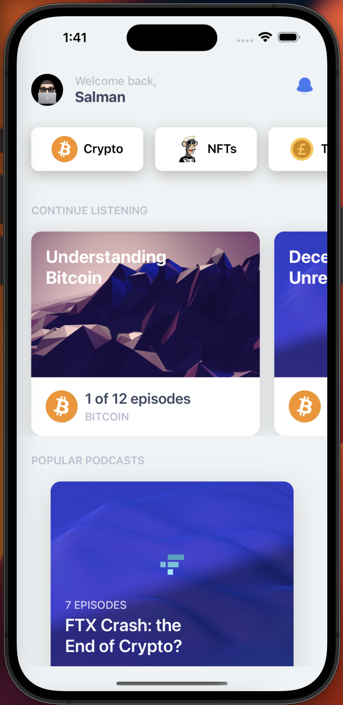

# 💷 Zeep App - Playlist UI

My vision for how Zeed's Podcast Player could look like.

This UI is currently being built with React Native, Redux and various APIs - the emphasis is on design, and the UX has been carefully thought upon to be as user-friendly as possible.

I used XD for wireframing and prototyping. 

## What it does 🤔

It shows a Home Screen, with promoted podcasts, popular episodes and various topics to choose from. 

## What I want it to do 🌈

Make content available offline.

Add Paid Podcasts, using the Stripe API, and allow people to subscribe/manage payments.

Wordpress or Retool backend to analyse those links in more depth. I could design a feature to let the user choose if he wants to include titles in the XML file. 

## Note

I am building this UI on the side, so it might not be 100% stable whe you try to run it.!

[Uploading Screenshot 2022-12-06 at 1.39.29 pm.png…]()

## Screenshot(s)

